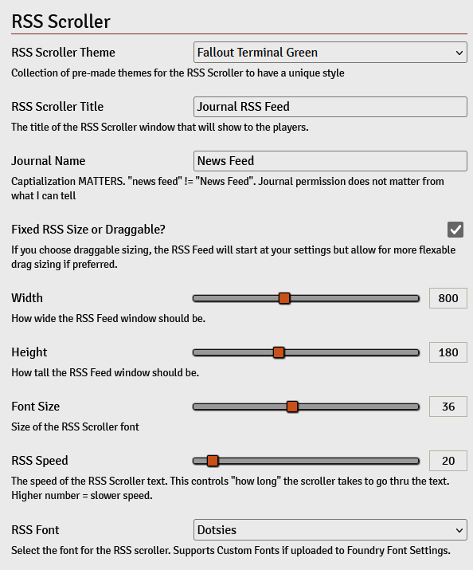

# FoundryVTT RSS Journal Text Scroller

## Overview

Do your Edgerunners watch the Corpo news propaganda that gets spread about them after their Friday Night Firefights? What about the weather before a road trip across the badlands? Is there a sale for the latest and greatest in Mr Stud or Midnight Lady technology your players have been looking for? Are there new deals for drinks at the local bar? Well now you can see it all laid out --- with a live news ticker in FoundryVTT! Feed your table in-universe headlines, corporate spin, or underground rumors straight from your journal entries. If you write it, the ticker runs it. 

The FoundryVTT RSS Scroller is a module that creates a scrolling text window in FoundryVTT using journal entries as the source for RSS-style news feeds. The feed is fully customizable, allowing adjustment to the theme, font size, scrolling speed, window dimensions, and more.


## Features

The Scroller reads text from a journal you set up and all it's entries or pages and displays it as a horizontal scrolling news ticker. Great for having in-world news for your table! Did the party do something crazy and the world should react? Here's the best way to do that!


Supports dynamic settings, allowing users or the GM to modify:

- RSS Scroller Theme (User)
- RSS Scroller Title (GM)
- RSS Scroller Font (User)
- RSS Journal Source (GM)
- Resizable or fixed window size (User)
- Default RSS Window width & height (GM)
- RSS Font size (User)
- RSS Scroll speed (User)

## Installation

1. Paste the `module.json` into your Foundry Module Manifest or clone the module into your FoundryVTT modules directory.

```
https://raw.githubusercontent.com/KaiibottAI/foundry-rss-scroller/main/module.json
```

or

```cmd
git clone https://github.com/KaiibottAI/foundry-rss-scroller.git
```

2. Add the module to your game via Manage Modules in FoundryVTT.
3. Enable it in your world modules.

## Settings


The module provides several customizable settings via Game Settings.



| Setting | Description | Default |
| :-: | - | :-: |
| RSS Scroller Theme | Change the colour theme of the RSS Scroller. There are three options available right now, CyberpunkRED, Deep Blue and Fallout Terminal Green | CyberpunkRED | 
| RSS Scroller Title | The title of the RSS Scroller window that will show to the players | "RSS Scroller" | 
| Journal Name | The Journal name where the RSS Scroller will retrieve information from. This RSS Scroller does respect any html code you may have for the text, for example bolding and italics. Does not respect images linked in the journal.| "News Feed" |
| Fixed RSS Size or Draggable? | Toggle for if the RSS Scroller should be resizable on the fly or if you prefer rigid numbers of the height and width | False |
| Width | The default width of the RSS Scroller window | 800 |
| Height | The default height of the RSS Scroller window | 100 |
| Font Size | The default font size of the RSS Scroller text | 40 |
| RSS Speed | The speed of the RSS Scroller text. Lower number = Faster speed | 20 |
| RSS Font | List of Fonts available for the Scroller to use. Uses the default Foundry Font listing | Orbital |

## How Does It Works?

The module reads the text from a specified journal entry in the game settings. It processes the text content, stripping unnecessary HTML tags, paragraghs and page breaks, and formatting it into a continuous scrolling ticker. The scroller applies Foundry settings to modify its appearance and behavior and is animated with CSS to create a seamless scrolling effect. Great for having news given back to your players about things happening in your world!

#### Future Enhancements

- Support for multiple feeds and cycling between them.
- Successfully added Themes in 1.1.1! 
    - ~~Additional customization options (e.g., text color, background color).~~
    - ~~Themes~~

#### Troubleshooting

- Journal entry not found? Double-check the name in the settings (case-sensitive).
    - Double check the name you have in the RSS Scroller setting `Journal Name`, capitalization does matter. "News Feed" is not equal to "news feed".
- Text scrolling too fast/slow?
    -  Adjust the RSS Speed setting to a higher number. This controls "how long" the text will take to scroll thru the feed. Higher number = Slower speed.
- Window size not right?
    -  Modify the Width and Height settings or toggle the "resizeable" setting on for more control.

## Macros available

Toggle the RSS Feed Window. This macro is included in a compendium on install for ease of access.
```javascript
toggleRSSFeed();
```

Toggle the RSS Feed Theme
```javascript
// If you want the red on red like an OG digital clock
applyTheme("cyberpunk-red");
// blue on blue like a super relaxed dark theme
applyTheme("deep-blue");
// green on green like a Fallout Terminal
applyTheme("fallout-nuclear");
```